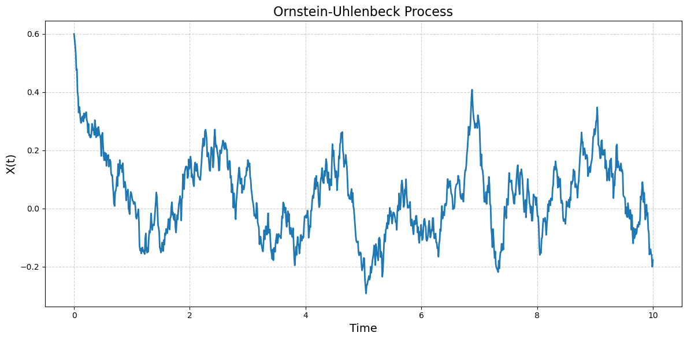

# PySDE

**`PySDE`** is a modular Python library for simulating, estimating, and analyzing **Stochastic Differential Equations (SDEs)** used in quantitative finance.

It provides ready-to-use implementations of models like Geometric Brownian Motion, Ornstein-Uhlenbeck, CIR, Heston, Jump-Diffusion, SABR, and more — along with tools to build your own custom SDEs from scratch.

---

## Installation

You can install the package (once published) using:

```bash
pip install PySDE
```

For now, clone the repo locally and install:

```bash
git clone https://github.com/yourname/fin-sde.git
cd PySDE
pip install -e .
```

---

## Use Cases

`PySDE` is designed for:

- **Simulate market processes** like GBM or Heston for backtesting or pricing
- **Estimate drift and diffusion parameters** from historical data
- **Build and test custom SDE models**, including volatility clustering or jumps
- **Visualize time series behavior** of stochastic processes
- **Generate synthetic training data** for ML models that capture real market dynamics

---

## Built-In Models

The library includes the following models:

- `Geometric Brownian Motion` (GBM)
- `Ornstein-Uhlenbeck` (OU)
- `Cox-Ingersoll-Ross` (CIR)
- `Heston` Stochastic Volatility
- `Merton Jump-Diffusion`
- `SABR` Volatility (β configurable)
- `Bates` (Heston + jumps)
- `Rough Volatility`

---

## Example Visualizations

### Ornstein-Uhlenbeck Process  
A mean-reverting process used in interest rates, spreads, and stat-arb:



---

### Geometric Brownian Motion  
Used in Black-Scholes and basic equity modeling:


---

### SABR Volatility Process  
Captures stochastic volatility with a power-law drift:


---

## Other Features

- Parameter estimation (MLE/GMM)
- Visualization
- User Defined SDEs

---

## License

MIT License

